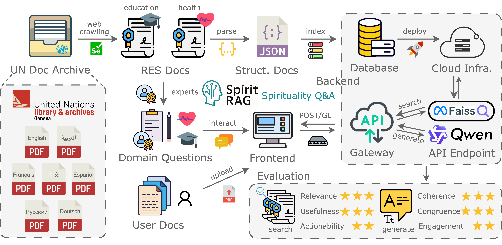

# SpiritRAG: A Q&A System for Religion and Spirituality in the United Nations Archive



This repository contains the code for the data processing (back-end), web application (front-end), and system deployment described in the paper ["SpiritRAG: A Q&A System for Religion and Spirituality in the United Nations Archive"](https://www.arxiv.org/abs/2507.04395).

We have received official **reject** to open-source the UN-RES dataset. If you are interested in getting the resolution documents, please run the crawler script in the back-end folder yourself.

## Claimer (as requested by the UN)

The content of this publication has not been approved by the United Nations and does not reflect the views of the United Nations or its officials or Member States.

## Citation

If you are using our platform, please cite the following paper in your work:

```
@article{
  title={{SpiritRAG: A Q&A System for Religion and Spirituality in the United Nations Archive}},
  author={Gao, Yingqiang and Winiger, Fabian and Montjourides, Patrick and Shaitarova, Anastassia and Gu, Nianlong and Peng-Keller, Simon and Schneider, Gerold},
  journal={arXiv preprint arXiv:XXX},
  year={2025}
}
```
